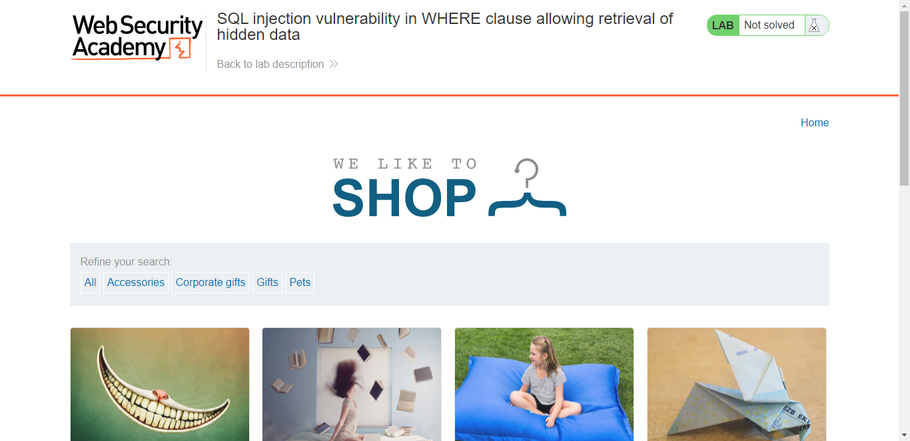
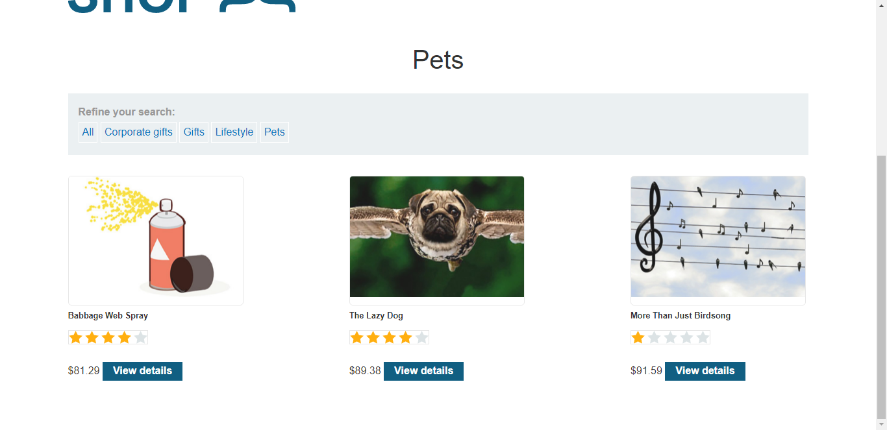
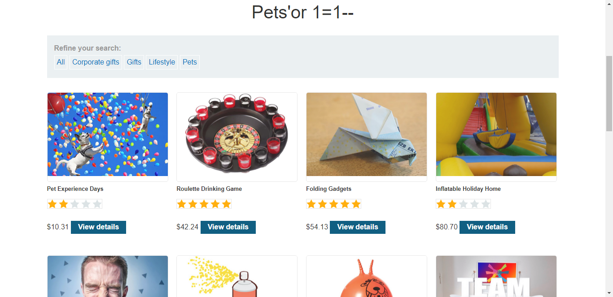

## Lab: SQL injection vulnerability in WHERE clause allowing retrieval of hidden data

#### Mô tả:

Lab này chứa lỗ hổng SQL injection trong bộ lọc danh mục sản phẩm. Khi người dùng chọn một danh mục, ứng dụng sẽ thực hiện một truy vấn SQL như sau:

    SELECT * FROM products WHERE category = 'Gifts' AND released = 1

Để giải quyết phòng thí nghiệm, hãy thực hiện một cuộc tấn công SQL injection khiến ứng dụng hiển thị chi tiết của tất cả các sản phẩm trong bất kỳ danh mục nào, cả đã phát hành và chưa phát hành.

> 

#### Hướng giải:

Việc đầu tiên trước khi muốn khai thác được thì phải xác định được các vị trí dễ xảy ra lỗi, thông thường là các là những nơi cho phép người dùng nhập một thứ gì đó vào (input) ví dụ như field nhập username, password, search,… miễn là cho phép người dùng nhập một thứ gì đó và gửi lên server. 

> Lab này chứa lỗ hổng SQL injection trong bộ lọc danh mục sản phẩm.

Ở phần mô tả, mình đã biết được lỗ hổng nằm trong phần bộ lọc danh mục, cứ từ đó mà đục vào thôi :>

Bài yêu cầu hiển thị ra tất cả các sản phẩm trong bất kỳ danh mục nào, cả đã phát hành và chưa phát hành. Để làm được, chắc chắn mình phải sử dụng tới dấu comment thần chú đã học trong phần lý thuyết.

- Đầu tiên mình thử click vào 1 danh mục có trong web. Ở đây mình sẽ click vào **Pets**.
- URL trả về truy vấn: `filter?category=Pets`
> 
- Lúc này trang web đang trả về danh mục sản phẩm **Pets**. Mục đích của mình là tạo được truy vấn 
**SELECT * FROM products WHERE category = 'Gifts' OR 1 = 1--**
Để trả về tất cả các giá trị của bảng.
- Mình sẽ tạo truy vấn đó thông qua URL của trang web. Chỉnh sửa thanh URL thành: 
`filter?category=Pets%27or+1=1--`
Lúc này trang web sẽ trả về tất cả các sản phẩm :> 
> 