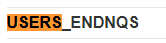
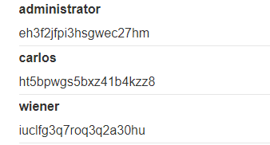

## Lab: SQL injection attack, listing the database contents on Oracle

#### Mô tả
Phòng thí nghiệm này chứa lỗ hổng SQLi trong bộ lọc danh mục sản phẩm. Kết quả từ truy vấn được trả về trong phản hồi của ứng dụng, do đó bạn có thể sử dụng một cuộc tấn công UNION để truy xuất dữ liệu từ các bảng khác.

Ứng dụng có chức năng đăng nhập và cơ sở dữ liệu chứa một bảng chứa tên người dùng và mật khẩu. Bạn cần xác định được tên của bảng này và các cột mà nó chứa, sau đó truy xuất nội dung của bảng để lấy tên người dùng và mật khẩu của tất cả người dùng.

Để giải quyết phòng thí nghiệm, hãy đăng nhập với tư cách người dùng quản trị viên.

#### Hướng giải
Về cơ bản, bài này giống Lab9, có điều phiên bản cơ sở dữ liệu khác nhau nên cú pháp cũng khác nhau.

Đầu tiên truy cập vào lab và xác định số cột tương thích định dạng chuỗi.

`' UNION SELECT 'a', 'a' FROM dual--`

Xác định được web có 2 cột đều có định dạng là string, ta tấn công để xem tên các bảng.

`' UNION SELECT table_name,null FROM all_tables--`

Web sẽ hiển thị ra rất nhiều tên các bảng mà nó có, mình Ctrl F tìm từ khóa _users_ 

> 

Mình xác định được tên bảng là **USERS_ENDNQS** thì bắt đầu tìm kiếm tên các cột trong bảng

`' UNION SELECT column_name,null FROM all_tab_columns WHERE table_name='USERS_ENDNQS'--`

> 

Ta lấy được tên của 2 cột là **PASSWORD_WCZTTD** và **USERNAME_DHUJYJ**. Tiếp tục truy vấn để lấy thông tin từ 2 cột này

> 

Vầy là kiếm được mật khẩu rùi :> 