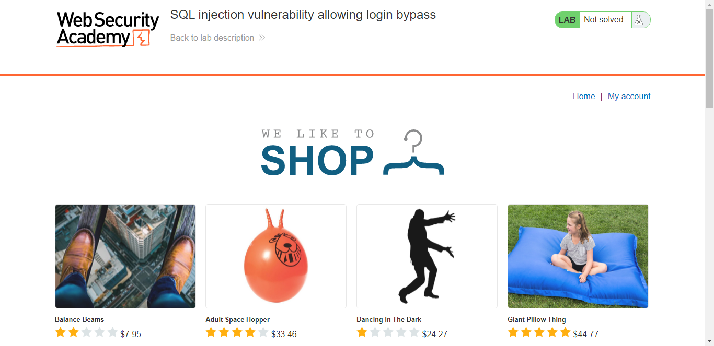
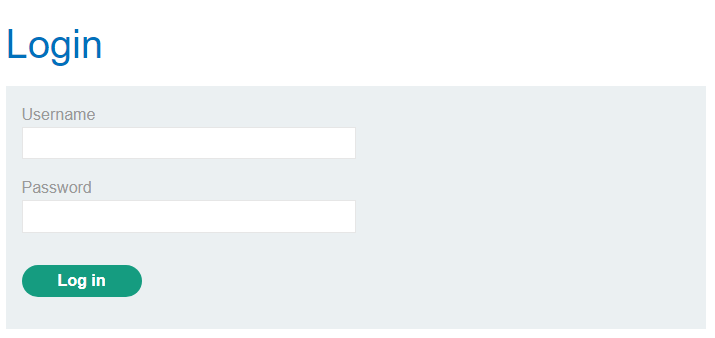
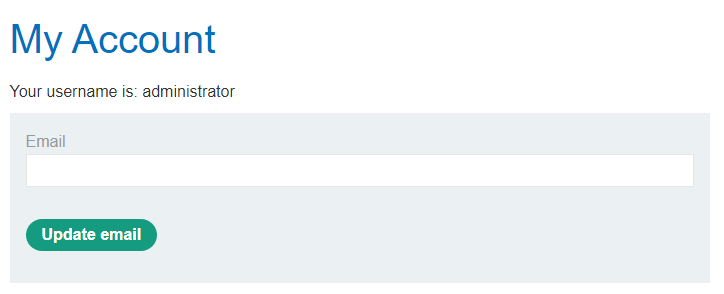

## Lab: SQL injection vulnerability allowing login bypass

#### Mô tả:
Phòng lab này chứa lỗ hổng SQLi trong chức năng đăng nhập.  
Để vượt qua thử thách này, thực hiện một cuộc tấn công SQLi để đăng nhập vào trang web bằng user `administrator`.  

#### Hướng giải quyết:
Truy cập vào trang web  

> 

Bài yêu cầu đăng nhập vào web nên mình nhanh trí vào check **My account** thì thấy có 1 form login.  
 
> 

Thử đăng nhập với username là **administrator** và mật khẩu là **123456** thì trang web thông báo sai tài khoản và mật khẩu :<  

Lúc này truy vấn của mình đang là  `SELECT * FROM users WHERE username = 'administrator' AND password = '123456'`

Muốn đăng nhập được chỉ còn cách brute mật khẩu hoặc lợi dụng lỗ hổng SQLi để bypass.  Muốn bypass được thì phải làm cho phần `AND password = '123456'` của truy vấn trên không còn hiệu lực. Nghĩ ngay đến việc chèn thêm 2 dấu gạch ngang vào thì phần sau nó sẽ trở nên vô nghĩa  

Lúc này truy vấn của mình sẽ phải có dạng `SELECT * FROM users WHERE username = 'administrator'--' AND password = '123456'`  

Thử login với username là **administrator'--** và điền bừa mật khẩu **123456** thì trang web thông báo mình đã đăng nhập với username là **administrator**, chứng tỏ truy vấn của mình đã chính xác

> 