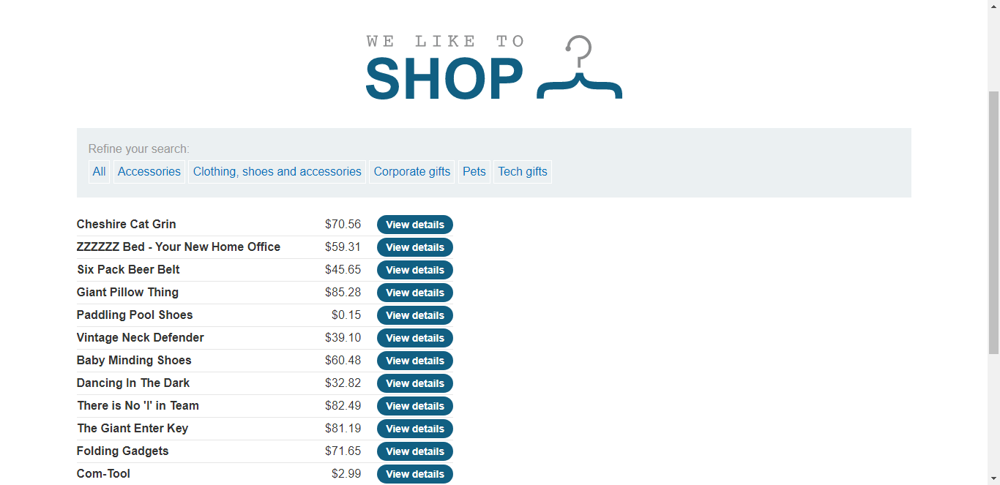
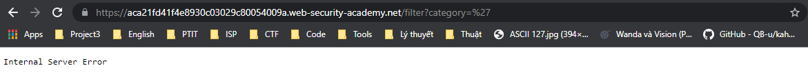
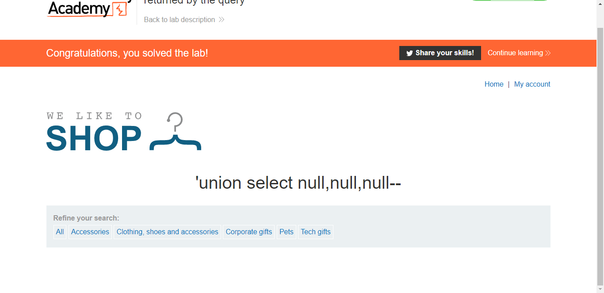

## Lab: SQL injection UNION attack, determining the number of columns returned by the query
#### Mô tả
Phòng lab này chứa lỗ hổng SQLi trong bộ lọc danh mục sản phẩm. Kết quả từ truy vấn được trả về trong phản hồi của ứng dụng, vì vậy bạn có thể sử dụng một cuộc tấn công UNION để truy xuất dữ liệu từ các bảng khác.

Bước đầu tiên của một cuộc tấn công là xác định số lượng cột được trả về bởi truy vấn. Sau đó, bạn sẽ sử dụng kỹ thuật này trong các phòng lab tiếp theo để xây dựng cuộc tấn công đầy đủ.

Để giải quyết phòng lab, hãy xác định số cột được trả về bởi truy vấn bằng cách thực hiện một cuộc tấn công SQLi UNION trả về một hàng bổ sung chứa giá trị null.

#### Hướng giải quyết

Việc đầu tiên trước khi muốn khai thác được thì phải xác định được các vị trí dễ xảy ra lỗi. Ở đây, đề bài đã chỉ rõ cho mình thấy 

> Phòng lab này chứa lỗ hổng SQLi trong bộ lọc danh mục sản phẩm.

Và yêu cầu **tìm ra được số cột được trả về bởi truy vấn category filter**

> 

Sau khi xác định được vị trí có lỗi và vấn đề cần giải quyết, chúng ta tiến hành truy cập vào lab. Đầu tiên là thực hiện các thao tác lọc (filter) các sản phẩm theo category (danh mục), ở đây mình chọn _Pets_

Ở đây chúng ta thấy, để filter được sản phẩm theo category thì từ phía người dùng đã gửi lên cho server một GET requests `/filter?category=Pets`, vậy input là `Pets`. Ta thử kiểm tra đầu vào có được xử lý cẩn thận hay không với một dấu nháy đơn (`'`). Kết quả:

> 

Như chúng ta thấy. Server bị lỗi, như vậy đã có lỗi xảy ra với câu truy vấn. Có thể phía bên server câu truy vấn lúc này là: `
SELECT ??? FROM ??? WHERE category='''`. Việc thêm một dấu ‘ đã khiến cho query bị lỗi do dư 1 dấu ‘. Ta tiếp tục sửa câu truy vấn: `' UNION SELECT null--`

Lúc này câu truy vấn phía server là: `
SELECT ??? FROM ??? WHERE category='' UNION SELECT null--'`

Câu truy vấn này nghĩa là: nối kết quả của câu truy vấn filter category với kết quả của câu truy vấn `SELECT null` (1 cột). Kết quả trả về vẫn báo lỗi, chứng tỏ số cột trả về nhiều hơn 1 cột. Ta thử lần lượt với 2, 3 cột đến khi truy vấn trả về kết quả. Khi thử đến cột thứ 3 thì truy vấn trả về kết quả, lúc này câu truy vấn là `UNION SELECT null,null,null--` và kết quả trả về 

> 