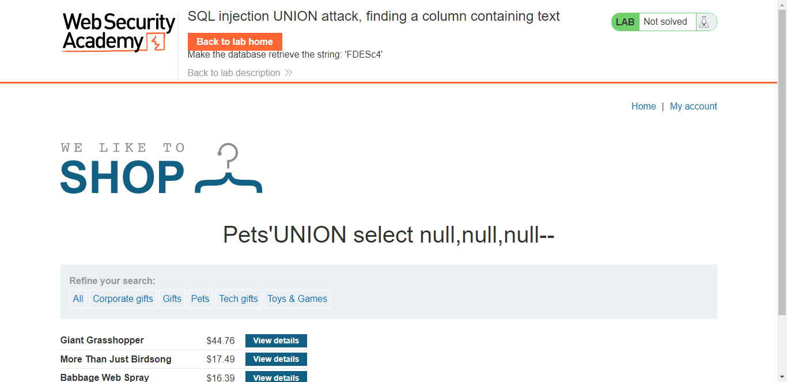
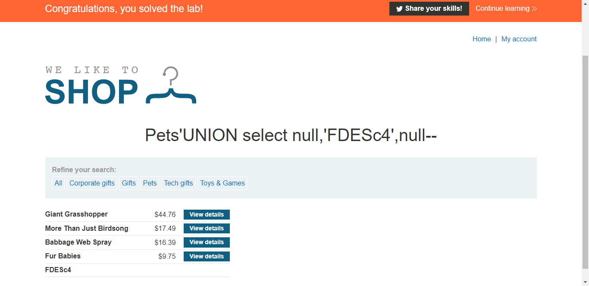

## Lab: SQL injection UNION attack, finding a column containing text

#### Mô tả
Phòng lab này chứa lỗ hổng SQLi trong bộ lọc danh mục sản phẩm. Kết quả từ truy vấn được trả về trong phản hồi của ứng dụng, vì vậy bạn có thể sử dụng một cuộc tấn công UNION để truy xuất dữ liệu từ các bảng khác. Trước tiên bạn cần xác định số cột được trả về bởi truy vấn bằng kỹ thuật đã làm trong Lab3. Bước tiếp theo là xác định cột tương thích với dữ liệu chuỗi.

Phòng lab sẽ cung cấp một giá trị ngẫu nhiên mà bạn cần để xuất hiện trong kết quả truy vấn. Để giải quyết nó, hãy thực hiện một cuộc tấn công SQLi UNION trả về một hàng bổ sung chứa giá trị được cung cấp. Kỹ thuật này giúp bạn xác định cột nào tương thích với dữ liệu chuỗi.

#### Hướng giải quyết
Việc đầu tiên là xác định lỗ hổng để tấn công SQLi, ở đây bài đã nói rõ 

> Phòng lab này chứa lỗ hổng SQLi ở danh mục sản phẩm.

Và việc mình cần làm là xác định được cột nào là dạng chuỗi trong kết quả trả về hàng bổ sung. Bài cũng đã gợi ý sử dụng phương pháp của Lab3 để check số cột của bảng bổ sung. Sau khi truy cập vào danh mục _Pets_ thì mình sử dụng truy vấn của Lab3

    UNION SELECT null,null,null--

Lúc này trang web trả về kết quả, vậy chắc chắn là có 3 cột trong bảng. Bài yêu cầu sử dụng giá trị chuỗi đã được cung cấp để thực hiện truy vấn

> 

Để ý góc trên màn hình sẽ thấy giá trị chuỗi mà bài cho là ***FDESc4***, mình thử lần lượt giá trị chuỗi này vào từng giá trị **null** ứng với truy vấn trên.

    UNION SELECT 'FDESc4',null,null--
    UNION SELECT null,'FDESc4',null--
    UNION SELECT null,null,'FDESc4'--

Khi thử truy vấn ở giữa, ứng với giá trị chuỗi là cột 2 thì ứng dụng phản hồi 

> 

Vậy ta có thể xác định được bảng trả về có 3 cột và cột thứ 2 có giá trị là 1 chuỗi
