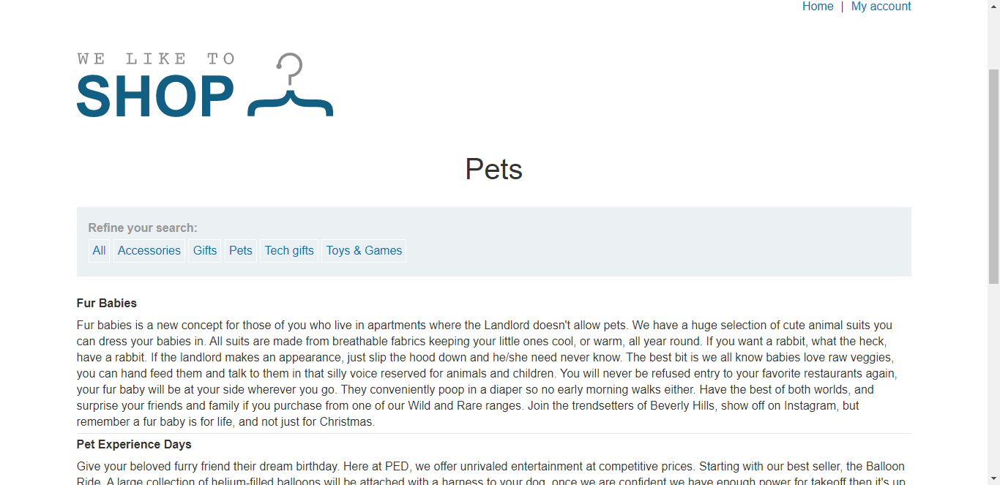
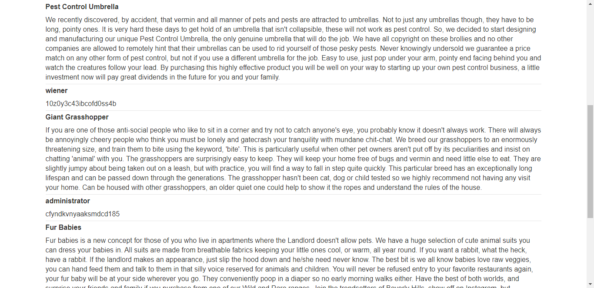
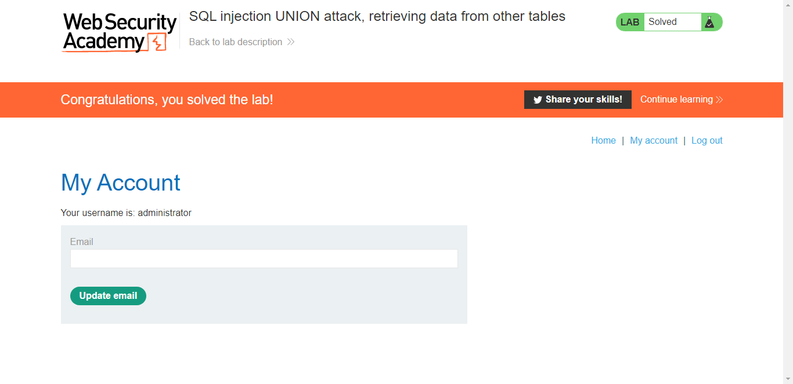

## Lab: SQL injection UNION attack, retrieving data from other tables
#### Mô tả
Lab chứa lỗ hổng SQLi trong bộ lọc danh mục sản phẩm. Kết quả từ truy vấn được trả về trong phản hồi của ứng dụng, vì vậy bạn có thể sử dụng một cuộc tấn công UNION để truy xuất dữ liệu từ các bảng khác. Để xây dựng một cuộc tấn công như vậy, bạn cần kết hợp một số kỹ thuật bạn đã học trong các phòng thí nghiệm trước đó.

Cơ sở dữ liệu chứa một bảng có tên là _users_, với các cột là _username_ và _password_. Để giải quyết phòng thí nghiệm, hãy thực hiện một cuộc tấn công SQLi UNION để truy xuất tất cả tên người dùng và mật khẩu, đồng thời sử dụng thông tin để đăng nhập với tư cách ***administrator***

#### Hướng giải
Đề bài đã chỉ rõ

> Lab chứa lỗ hổng SQLi trong bộ lọc danh mục sản phẩm.

Truy cập vào phòng lab và tiếp tục truy cập vào danh mục *Pets*. Lúc này truy vấn đang gửi lên server là `filter?category=Pets`

> 

Bài yêu cầu truy cập vào bảng *users* nên mình nhanh trí sử dụng câu lệnh **UNION** để nối lệnh truy cập tới 2 cột _username_ và _password_ của bảng 

    ' UNION SELECT username,password FROM `users--`

Lúc này truy vấn gửi lên web là `filter?category=Pets%27union+select+username,password+from+users--`

Trang web trả về kết quả 

> 

Kéo xuống, ta thấy ứng dụng đã trả về thêm bảng *users* với *username* và *password*. Bài yêu cầu đăng nhập vào account **administrator** nên mình sẽ lấy mật khẩu của account đó vào đăng nhập trong mục **My account**. Ở đây, *username* là **administrator** và *password* là **cfyndkvnyaaksmdcd185**

> 

Đăng nhập vào và mình đã giải quyết xong lab :>

