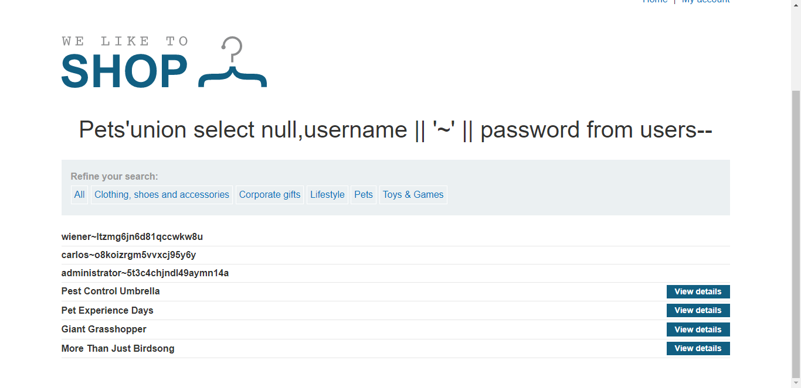

## Lab: SQL injection UNION attack, retrieving multiple values in a single column
Phòng thí nghiệm này chứa lỗ hổng SQLi trong bộ lọc danh mục sản phẩm. Kết quả từ truy vấn được trả về trong phản hồi của ứng dụng, do đó bạn có thể sử dụng một cuộc tấn công UNION để truy xuất dữ liệu từ các bảng khác.

Cơ sở dữ liệu chứa một bảng khác tên là *users*, với các cột được gọi là tên *username* và *password*.

Để giải quyết phòng thí nghiệm, hãy thực hiện một cuộc tấn công SQLi UNION để truy xuất tất cả *username* và *password* dưới dạng 1 cột duy nhất, đồng thời sử dụng thông tin để đăng nhập với tư cách *administrator*.

#### Hướng giải
Bài đã chỉ rõ 

> Phòng thí nghiệm này chứa lỗ hổng SQLi trong bộ lọc danh mục sản phẩm.

Truy cập vào lab và chọn 1 danh mục may mắn là _Pets_ để chọc thuii. Lúc này truy vấn đang là `filter?category=Pets`

Như đã làm ở Lab5, mình phải gửi lên được truy vấn có dạng `' UNION SELECT username,password FROM users--` để lấy được thông tin bảng *users*. 

Đầu tiên check xem bảng đó có mấy cột đã :> Thử lần lượt payloads `UNION SELECT null--` từ 1 cột tăng dần đến 2 cột thì thấy trang web trả về kết quả. Vậy là bảng này có 2 cột. 

Bởi vì *username* và *password* phải được lưu dưới dạng chuỗi nên bước tiếp phải kiểm tra xem trong 2 cột đó thì cột nào có dạng chuỗi bằng truy vấn `UNION SELECT null,'a'--` thì ứng dụng trả về kết quả. Vậy trong 2 cột chỉ có cột thứ 2 có dạng chuỗi và nó lưu trữ *username* lẫn *password*.

Để lấy được 2 thông tin từ cùng 1 cột, mình đáp truy vấn 

    UNION SELECT null,username || '~' || password FROM users--

Có ngay kết quả trả về 

> 

Có được thông tin của acc *administrator* với *pass* là **5t3c4chjndl49aymn14a** mình log vào acc đó trong ***My account*** là hoàn thành phòng lab