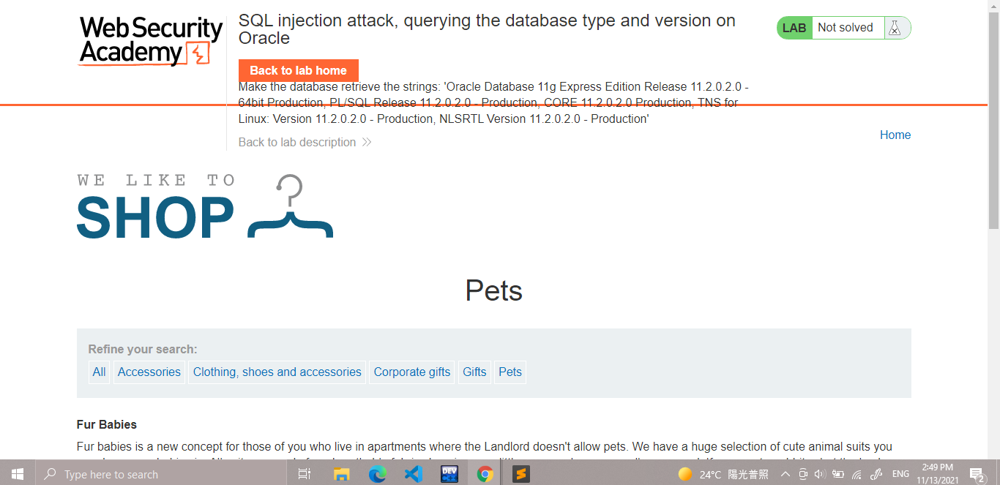
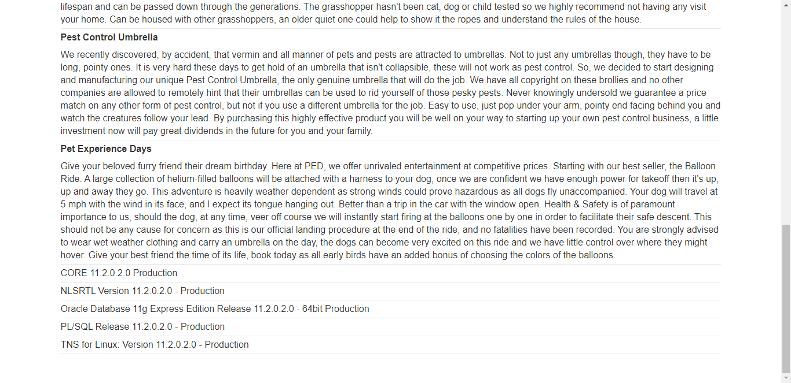

## Lab: SQL injection attack, querying the database type and version on Oracle

#### Mô tả
Phòng thí nghiệm này chứa lỗ hổng SQLi trong bộ lọc danh mục sản phẩm. Bạn có thể sử dụng một cuộc tấn công UNION để lấy kết quả từ một truy vấn được đưa vào.

Để hoàn thành bài tập, hãy hiển thị chuỗi phiên bản cơ sở dữ liệu của phòng thí nghiệm này.

#### Hướng giải
Đề bài đã nói rõ 

> Phòng thí nghiệm này chứa lỗ hổng SQLi trong bộ lọc danh mục sản phẩm

Sau khi truy cập vào lab thì chọn 1 danh mục may mắn là _Pets_ để truy cập. 

> 

Lúc này truy vấn đang gửi đi là `filter?category=Pets`. Bài lab yêu cầu phải in ra version đầy đủ của database, cụ thể như hình trên. 

Cách giải quyết của mình là tìm được ít nhất 1 cột cho phép in ra dữ liệu kiểu chuỗi và thử các câu truy vấn version của  Oracle (bài đã cho là Oracle :v ) nếu câu truy vấn hợp lệ sẽ in ra màn hình version của database đang được sử dụng cho chúng ta.

Trong mô tả của Oracle có viết: 

 > - Trong Oracle, mọi câu lệnh SELECT phải đi với FROM, cho dù không biết
   tên bảng thì vẫn phải có từ khóa `FROM dual`. Nó giống như cách gọi
   bình thường không có FROM của các cơ sở dữ liệu khác 
 > - Nên về bản chất chúng ta sử dụng input `'UNION  SELECT  null, null  FROM  DUAL--` thì cũng giống như chúng ta viết `'UNION  SELECT  null,
   null  --`

Vậy việc đầu tiên là xác định số cột của database bằng truy vấn `' UNION SELECT null FROM dual--` và tăng dần số lượng cột. Với truy vấn `null,null` thì trang web phản hồi kết quả, vậy xác định được bảng có 2 cột. 

Thông tin của cơ sở dữ liệu chắc chắn phải được lưu trữ dưới dạng chuỗi, vì vậy tiếp theo ta kiểm tra 2 cột đó có cột nào tương thích với dạng chuỗi. 

`'UNION  SELECT  'a', null  FROM  DUAL--`
`etc...`

Thử lần lượt thì thấy cả 2 cột đều trả về dạng chuỗi. Lúc này ta thực hiện truy vấn `' UNION SELECT null, banner FROM v$version--`. Truy vấn này dành riêng cho phiên bản Oracle, với các phiên bản khác có thể tra cú pháp trong [SQL cheat sheet](https://portswigger.net/web-security/sql-injection/cheat-sheet)

> 
