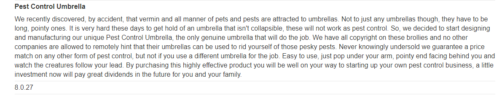

## Lab: SQL injection attack, querying the database type and version on MySQL and Microsoft

#### Mô tả
Phòng thí nghiệm này chứa lỗ hổng SQLi trong bộ lọc danh mục sản phẩm. Bạn có thể sử dụng một cuộc tấn công UNION để lấy kết quả từ một truy vấn được đưa vào.

Để giải phòng thí nghiệm, hãy hiển thị chuỗi phiên bản cơ sở dữ liệu.

#### Hướng giải
Về cơ bản, bài này giống Lab7, chỉ khác nhau ở phiên bản cơ sở dữ liệu dẫn đến những cú pháp khác nhau. Còn các bước chủ yếu thì y chang bài cũ.

Trước hết thì mình truy cập vào Lab, vào danh mục _Pets_ và check cú pháp trong [SQL cheat sheet](https://portswigger.net/web-security/sql-injection/cheat-sheet). Ở đây mình cần check là phiên bản Microsoft và MySQL. Đối với MySQL thì phần comment cũng là 2 dấu gạch ngang nhưng nó cần có thêm khoảng trắng phía sau. Nếu mình để truy vấn `'UNION SELECT null,null--` khi lên URL nó sẽ tự động xóa khoảng trắng sau dấu gạch ngang của mình, vì vậy phải chèn thêm 1 ký tự nào đó vào sau khoảng trắng đó thì nó mới k bị xóa. Mình đổi truy vấn thành `'UNION SELECT null,null-- hi` thì trang web có phản hồi, có thể kết luận bảng có 2 cột.

Tiếp theo kiểm tra trong 2 cột đó có chứa dạng string hay không bằng truy vấn `'UNION SELECT 'a','a'--` và kết quả trả về cả 2 cột đều là string. Lúc này mình có thể kiểm tra phiên bản bằng truy vấn 

`'UNION SELECT @@version,null-- hi` 

`@@version` có thể chèn vào cột 1 hay cột 2 đều được vì nó đều trả về dạng string và đều trả về phiên bản của cơ sở dữ liệu

> 